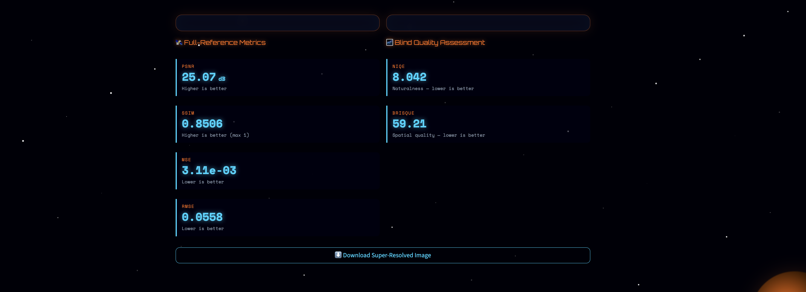
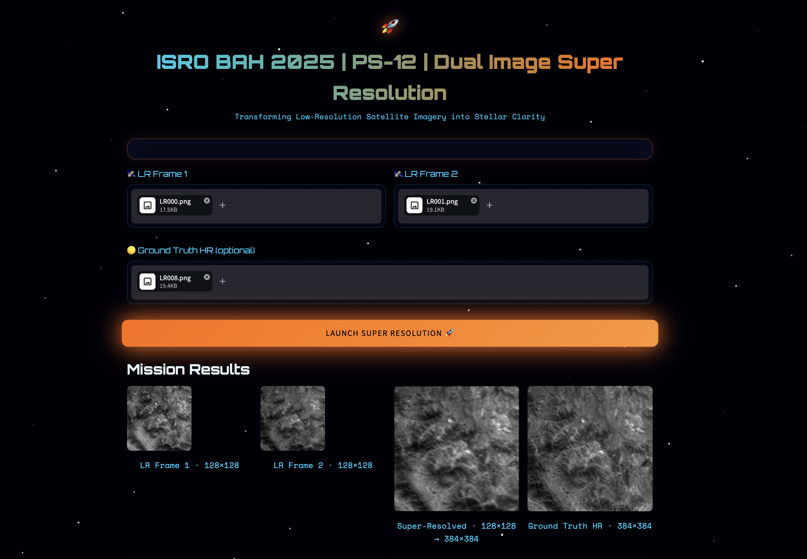
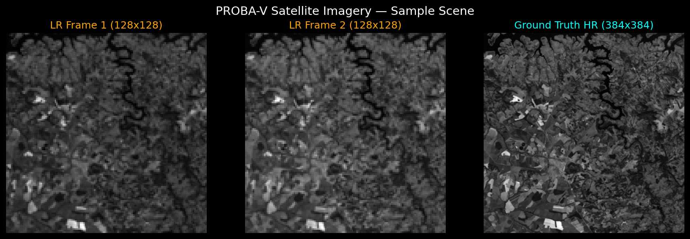
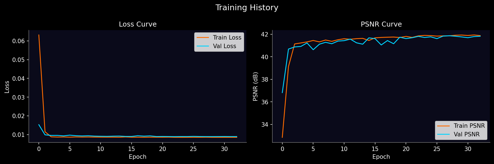
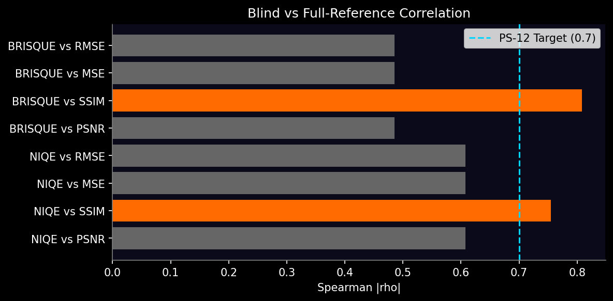

# 🛰️ SatSR -Dual Image Super Resolution for High-Resolution Optical Satellite Imagery and its Blind Evaluation

> **Fusing dual low-resolution PROBA-V frames into high-resolution optical imagery — with full-reference and blind quality assessment for ISRO PS-12.**

[](https://www.python.org/)
[](https://www.tensorflow.org/)
[](https://streamlit.io/)
[](https://github.com/sandeepsahu1808/satellite-sr)

SatSR is an end-to-end super-resolution pipeline for **ISRO Bharatiya Antariksh Hackathon 2025 — Problem Statement 12**. It takes two shifted low-resolution (128×128) satellite frames, selects the best pair via quality masks, fuses them with a **dual-branch CNN** (shared weights), and produces a 384×384 high-resolution image. The project includes full-reference metrics (PSNR, SSIM, MSE, RMSE), blind metrics (NIQE, BRISQUE), Spearman correlation analysis, and an immersive **Streamlit** demo.

---

## 🚀 App Interface

Space-themed Streamlit demo for **ISRO BAH 2025 | PS-12** — upload two LR frames, optional HR ground truth, and run dual-image super-resolution.

**Upload & launch** — select LR Frame 1 and LR Frame 2 (PROBA-V PNGs), optionally add HR, then click **LAUNCH SUPER RESOLUTION**.



**Mission results** — LR1 | LR2 | Super-Resolved (128×128 → 384×384) | Ground Truth HR, with full-reference and blind quality metrics.



---

## 📊 Sample Results

Side-by-side visualization of LR Frame 1, LR Frame 2, and super-resolved output (128×128 → 384×384) on PROBA-V RED band scenes.



---

## 📈 Training History

Validation loss and PSNR across training epochs (70% MSE + 30% SSIM loss, Adam 1e-4).



---

## 🔗 Blind–Reference Correlation

Spearman rank correlation between blind scores (NIQE, BRISQUE) and full-reference metrics on the test set. PS-12 target: |ρ| ≥ 0.7.



---

## 🏗️ Architecture

```
┌──────────────────────────────────────────────────────────────┐
│                    Streamlit App (app.py)                     │
│         Upload LR1 + LR2 → Preprocess → Predict → Metrics     │
└────────────────────────────┬─────────────────────────────────┘
                             │
                             ▼
┌──────────────────────────────────────────────────────────────┐
│              Input Stack  (384 × 384 × 2)                     │
│              [bicubic LR1 ∥ bicubic LR2]                      │
└──────────────┬─────────────────────────────┬─────────────────┘
               │                             │
               ▼                             ▼
┌──────────────────────────┐   ┌──────────────────────────┐
│  Branch 1 — LR1 (ch 0)   │   │  Branch 2 — LR2 (ch 1)   │
│  Conv 3×3, 64, relu  ×2  │   │  Conv 3×3, 64, relu  ×2  │  ← shared weights
└──────────────┬───────────┘   └──────────────┬───────────┘
               │                             │
               └──────────────┬──────────────┘
                              ▼
               ┌──────────────────────────────┐
               │  Concatenate  (384×384×128)  │
               └──────────────┬───────────────┘
                              ▼
               ┌──────────────────────────────┐
               │  Fusion                      │
               │  Conv 1×1, 64 → 3×3, 32      │
               │  → Conv 3×3, 1 (linear)      │
               └──────────────┬───────────────┘
                              ▼
               ┌──────────────────────────────┐
               │  Output HR  (384 × 384 × 1)  │
               └──────────────────────────────┘
```

**Baseline:** `build_srcnn()` — single-stack SRCNN (9×9 → 1×1 → 5×5 conv).  
**Dual model:** `build_dual_sr()` — shared-weight dual branch + fusion (`weights/best_dual_model.h5`).

---

## 📋 Model Performance

Test-set results (90 scenes, PROBA-V RED band, dual-branch model with perceptual MSE loss):

| Metric | Value | Notes |
|--------|-------|-------|
| **PSNR** | **41.81 dB** | Higher is better |
| **SSIM** | **0.9639** | Higher is better (max 1.0) |
| **NIQE** | 12.93 | Lower is better |
| **BRISQUE** | 94.68 | Lower is better |

**Blind ↔ full-reference agreement (Spearman |ρ|):**

| Comparison | \|ρ\| | PS-12 (≥ 0.7) |
|------------|-------|----------------|
| NIQE vs SSIM | 0.755 | ✅ |
| BRISQUE vs SSIM | 0.809 | ✅ |

---

## 🗂️ Project Structure

```
satellite-sr/
│
├── app.py                          # Streamlit demo (ISRO space theme)
├── requirements.txt
├── README.md
│
├── assets/
│   ├── app_screenshot_1.png
│   ├── app_screenshot_2.png
│   ├── sample_result.png
│   ├── training_history.png
│   └── correlation_plot.png
│
├── src/
│   ├── data/
│   │   ├── dataset_loader.py       # PROBA-V scenes, QM-based LR pair selection
│   │   ├── preprocessing.py        # Bicubic upsample, augment, stack LR1+LR2
│   │   └── data_generator.py       # Keras Sequence batch loader
│   ├── models/
│   │   ├── srcnn.py                # Baseline SRCNN
│   │   └── dual_sr_model.py        # Dual-branch shared-weight SR
│   ├── training/
│   │   ├── train.py                # Training script (--model srcnn|dual)
│   │   └── losses.py               # 70% MSE + 30% (1−SSIM) loss
│   └── evaluation/
│       ├── full_reference.py       # PSNR, SSIM, MSE, RMSE
│       ├── blind_metrics.py        # NIQE, BRISQUE (piq)
│       └── correlation.py          # Spearman blind vs full-reference
│
├── data/
│   └── probav_data/train/RED/      # 594 scenes (LR000–LR017 + QM + HR)
│
├── weights/
│   ├── best_model.h5               # SRCNN checkpoint
│   └── best_dual_model.h5          # Dual-branch checkpoint
│
└── results/
    ├── training_log.csv
    ├── metrics_log.csv
    ├── blind_metrics_log.csv
    └── correlation_report.csv
```

---

## ⚙️ Setup & Run

### 1. Clone & create virtual environment

```bash
git clone https://github.com/sandeepsahu1808/satellite-sr.git
cd satellite-sr
python -m venv venv
source venv/bin/activate          # Windows: venv\Scripts\activate
pip install -r requirements.txt
```

### 2. Download PROBA-V dataset

Download from [ESA PROBA-V Super Resolution (Zenodo)](https://zenodo.org/records/3840519) and extract so scenes live under:

```
data/probav_data/train/RED/imgset0001/
    LR000.png … LR017.png, QM000.png … QM017.png, HR.png
```

### 3. Train

```bash
# Baseline SRCNN
PYTHONPATH=. python src/training/train.py --epochs 50 --batch_size 8

# Dual-branch model (saves weights/best_dual_model.h5)
PYTHONPATH=. python src/training/train.py --model dual --epochs 50 --batch_size 8
```

### 4. Evaluate

```bash
PYTHONPATH=. python src/evaluation/full_reference.py
PYTHONPATH=. python src/evaluation/blind_metrics.py
PYTHONPATH=. python src/evaluation/correlation.py
```

### 5. Run Streamlit app

```bash
PYTHONPATH=. streamlit run app.py
```

Place trained weights at `weights/best_model.h5` (or `best_dual_model.h5` if you wire the app to dual weights).

---

## 📦 Dataset

| Property | Detail |
|----------|--------|
| **Source** | [PROBA-V Super Resolution — ESA / Zenodo](https://zenodo.org/records/3840519) |
| **Scenes** | 594 train scenes (RED band) |
| **LR size** | 128×128 (300 m GSD) |
| **HR size** | 384×384 (100 m GSD) |
| **LR frames** | Up to 18 per scene + quality masks (QM) |
| **Selection** | Best 2 LR frames per scene (highest QM good-pixel fraction) |
| **Split** | 70% train / 15% val / 15% test (`seed=42`) |

---

## 🛠️ Tech Stack

| Category | Technology | Purpose |
|----------|------------|---------|
| Deep Learning | TensorFlow / Keras | SRCNN & dual-branch training |
| Image I/O | OpenCV, Pillow | 8/16-bit PNG load, resize, display |
| Metrics (FR) | scikit-image | PSNR, SSIM |
| Metrics (NR) | piq, PyTorch | NIQE, BRISQUE |
| Statistics | pandas, SciPy | Correlation reports |
| App | Streamlit | Interactive SR demo |
| Language | Python 3.12 | End-to-end pipeline |

---

## ⚠️ Limitations

- Trained on **PROBA-V RED band only** — not multispectral or other sensors
- **Bicubic upsampling** of LR inputs to 384×384 before fusion (baseline alignment, not learned sub-pixel registration)
- **No sub-pixel registration** module — assumes PROBA-V pre-aligned frame pairs
- Blind metrics (NIQE/BRISQUE) are **no-reference proxies** — not a substitute for ground-truth HR in operations
- Model size and latency not optimized for **on-board satellite** deployment
- Educational / hackathon scope — **not validated for operational ISRO missions**

---

## Disclaimer

> ⚠️ This project was developed for the **ISRO Bharatiya Antariksh Hackathon 2025 (PS-12)** as a research and demonstration artifact.  
> It is not an official ISRO product and is not intended for operational satellite image production without further validation.

---

## License

MIT License — Copyright (c) 2025 Sandeep Sahu

Permission is hereby granted, free of charge, to any person obtaining a copy of this software and associated documentation files (the "Software"), to deal in the Software without restriction, including without limitation the rights to use, copy, modify, merge, publish, distribute, sublicense, and/or sell copies of the Software, and to permit persons to whom the Software is furnished to do so, subject to the following conditions:

The above copyright notice and this permission notice shall be included in all copies or substantial portions of the Software.

THE SOFTWARE IS PROVIDED "AS IS", WITHOUT WARRANTY OF ANY KIND, EXPRESS OR IMPLIED, INCLUDING BUT NOT LIMITED TO THE WARRANTIES OF MERCHANTABILITY, FITNESS FOR A PARTICULAR PURPOSE AND NONINFRINGEMENT. IN NO EVENT SHALL THE AUTHORS OR COPYRIGHT HOLDERS BE LIABLE FOR ANY CLAIM, DAMAGES OR OTHER LIABILITY, WHETHER IN AN ACTION OF CONTRACT, TORT OR OTHERWISE, ARISING FROM, OUT OF OR IN CONNECTION WITH THE SOFTWARE OR THE USE OR OTHER DEALINGS IN THE SOFTWARE.
